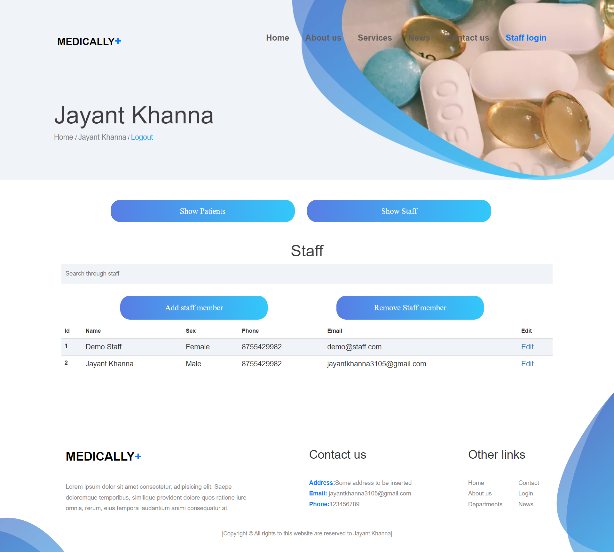

# Medically

This is a hospital based website called medically. Ahead you will find all realted ss and what happend on that page.

## Home page

When you open the website at top you will have nav bar with following options: 

- Logo (redirects to home page)
- Home (Home page)
- About us (A little history of website and some random text)
- Services (A default page)
- News (A default page)
- Contact us (Here you can contact with me by sending me mail)
- Staff Login (Here you can login to my site and explore more features)
 

- Next notable feature on Home page is 'Comments section' press on persons pic to view their comment you can also add your own comment
- You can also book an appointment from this page and see it on login page
- Rest all, is just front end work to make site look presentatble

## About us page
- It contains a small text about the site and a link to my github account 
- You can expand and close accordians on this page

## Services and News

- These pages were not coded and you will be redirected to default page

## Contact us
- First it also has same book appointment part just like home page you can make appointment from here too
- Next part is contact us section you can enter yourname subject email and message and it will be sent to me 

## Login page
- This is where magic happens
- First two paras on the page explain how to login as a doctor or as a staff member
- Simply press on autofill to fill in details in login tab 
- Press login (if username or password are incorrect you will be alerted)
- Toggle between login as staff and doctor to login respectively
- Although forgot password works it wont work there as gmail id used are not real 

 ### Forgot password section:
 - You can try it by logging in as doctor then adding a staff member with your own id and all passwords are hashed so there would be no security breach regarding your password
 - First you will be sent otp on your mail if you are an authorized member
 - After you enter otp site will ask you to type in new password 
 - After that you can login with that new password

## Staff login  
- After you login as a default staff member you will see a list of demo patients and your own name if you booked appointment earlier
- You can use Searchbar to search amongst appointments
- You can also add appointment here
- However remove and edit appointment have been disabled in demo user for security purposes. To use them you can contact me via email and i will provide you credentials for super user for both staff and doctor panel
- Option to log out has also been provided

## Staff Add a patient

- You can add a patient by clicking on add patient button
- You will be show a modal with a form where you can enter details of patient

## Staff Remove a patient

- You can remove a patient by clicking on remove button
- You will be show a modal with a form where you can enter details of patient

## Staff Edit a patient

- You can edit a patient by clicking on edit button
- You will be show a modal with a form where you can enter details of patient

## Doctor login  
- After you login as a default Doctor you will see option to toggle between staff and appointment list 
- On appointment list you will demo patients and your own name if you booked appointment earlier
- On staff list you will see all staff members
- You can use Searchbar to search amongst appointments and staff member
- You can also add appointment and new staff members here but those staff members also wont have option to edit or delete data
- To edit or delete data contact me i will provide you with credentials to Super doctor and staff data
- Option to log out has also been provided

## Doctor Add a patient

- You can add a patient by clicking on add patient button
- You will be show a modal with a form where you can enter details of patient

## Doctor Remove a patient

- You can remove a patient by clicking on remove button
- You will be show a modal with a form where you can enter details of patient

## Doctor Edit a patient

- You can edit a patient by clicking on edit button
- You will be show a modal with a form where you can enter details of patient

## Doctor Add a staff

- You can add a staff by clicking on add staff button
- You will be show a modal with a form where you can enter details of staff

## Doctor Remove a staff

- You can remove a staff by clicking on remove button
- You will be show a modal with a form where you can enter details of staff

## Doctor Edit a staff

- You can edit a staff by clicking on edit button
- You will be show a modal with a form where you can enter details of staff

